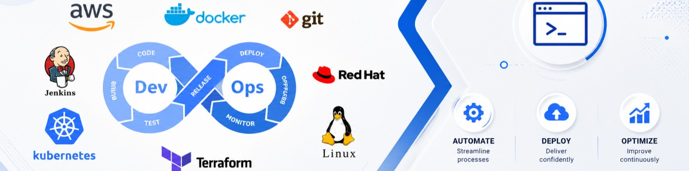

  

<h1 align="center">Hi 👋, I'm Mayur Sable</h1>

<h3 align="center">
Aspiring DevOps & Cloud Enginner 
</h3>

Passionate about building reliable, scalable, and automated infrastructure using modern Cloud and DevOps technologies.

---

## 👨‍💻 About Me

I am an **Aspiring DevOps & Cloud Engineer** with a strong foundation in **Linux System Administration** and a growing interest in **Cloud Computing, Containerization, Infrastructure as Code, and Automation**.

I enjoy working with technologies that help **automate deployments, improve system reliability, and simplify infrastructure management**. I have hands-on experience with **Linux, AWS, Docker, Kubernetes, Terraform, Git/GitHub, Bash scripting, and GenAI**, and I continuously strengthen my skills through practical learning and hands-on experimentation.

My goal is to build a career in **Cloud & DevOps**, contribute to real-world infrastructure and automation projects, and continuously learn and grow with evolving technologies.

---

## 🚀 Top Skills

* 🐧 Linux System Administration | CLA & RHCSA | AWS ☁️ | Docker 🐳 | Kubernetes | Terraform |🌿 Git & GitHub | RHEL | Ubuntu | Rocky Linux | openSUSE | GenAI 🤖

---

## 📫 Connect With Me

* 💼 **LinkedIn:** https://www.linkedin.com/in/sablemayur/
* 💻 **GitHub:** https://github.com/SableMayur

---

> **"Learn consistently. Build practical projects. Share your knowledge."** 🚀
